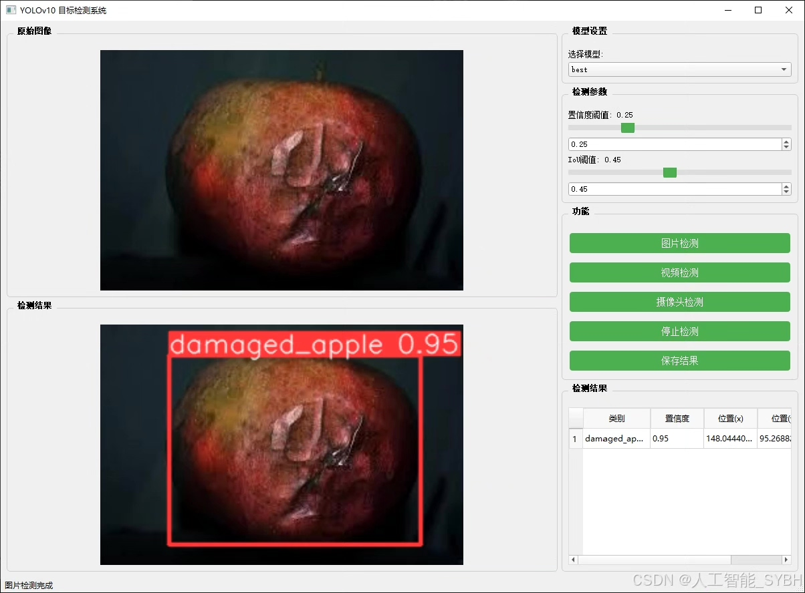
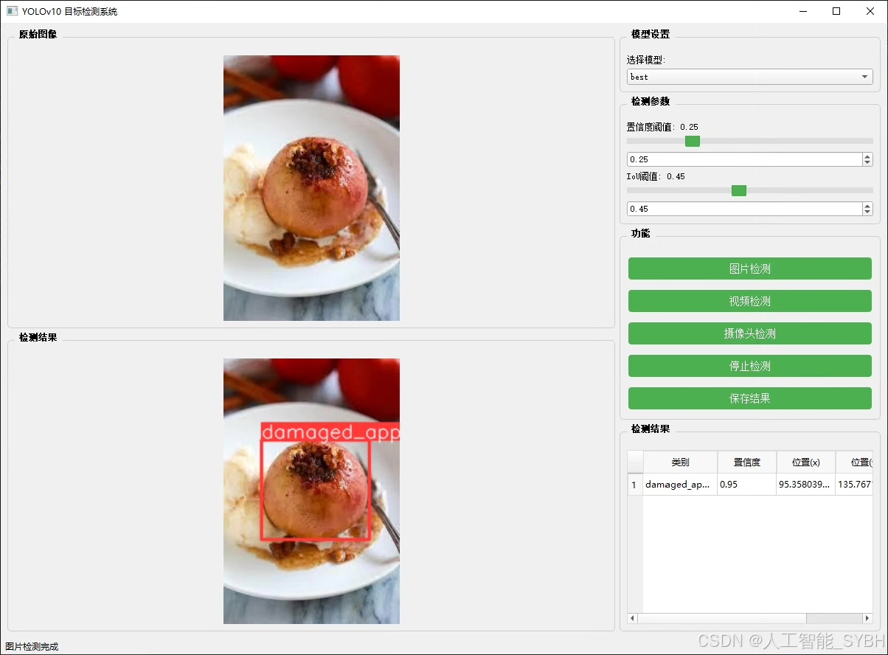
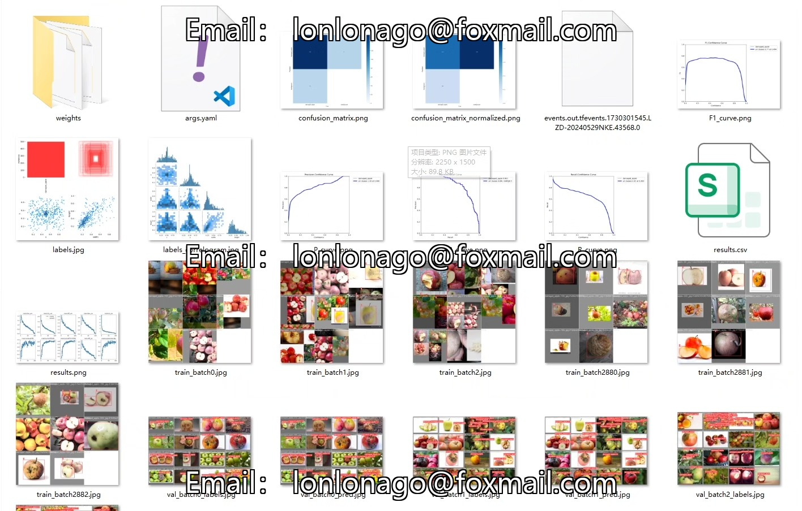
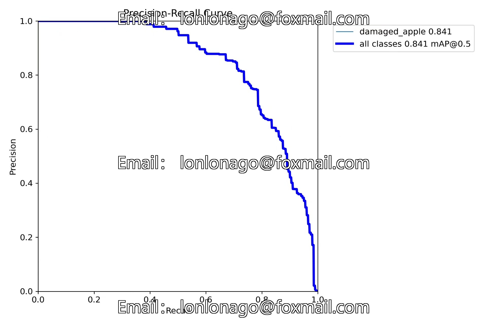
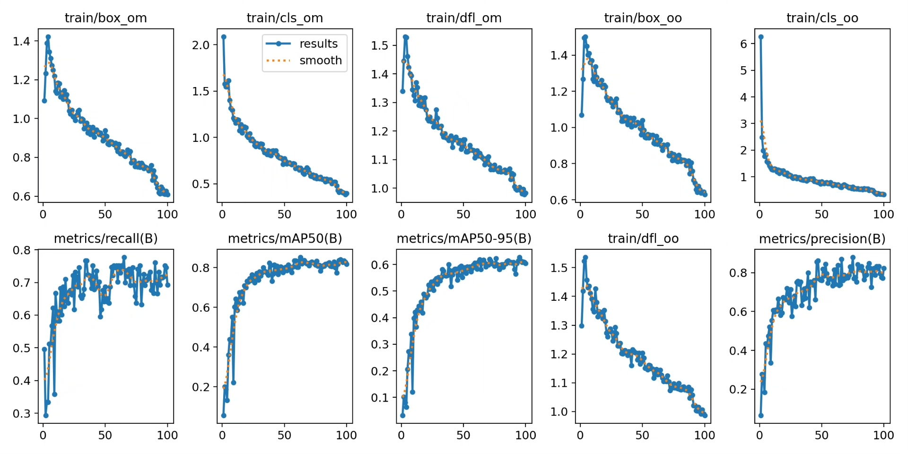
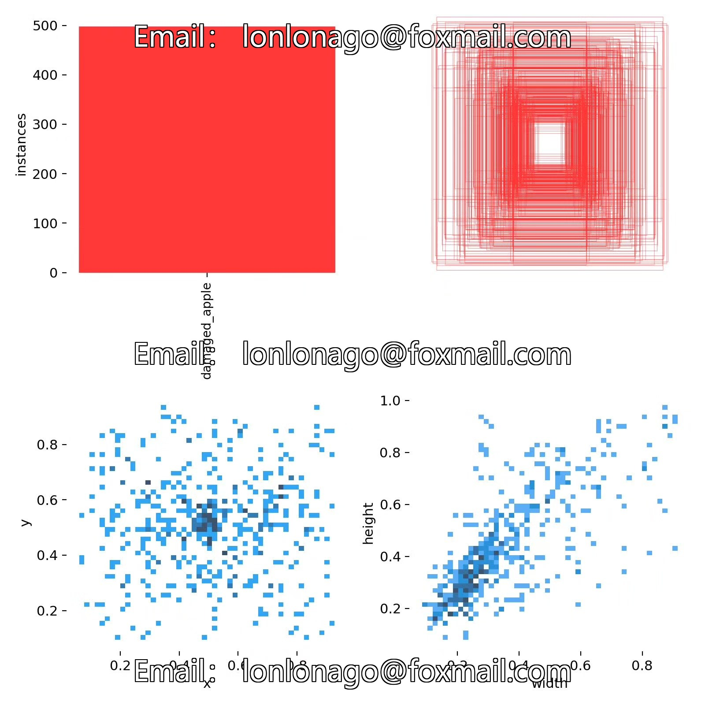
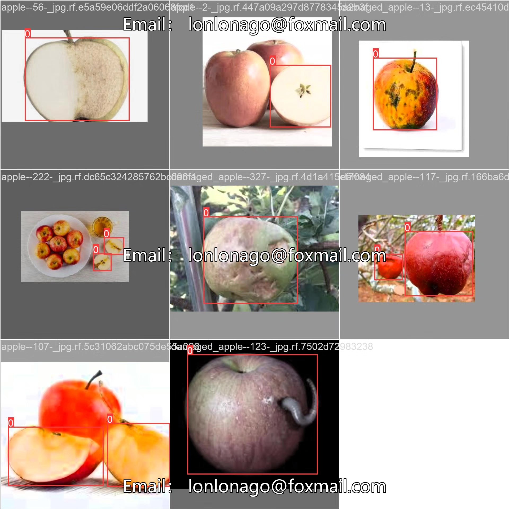
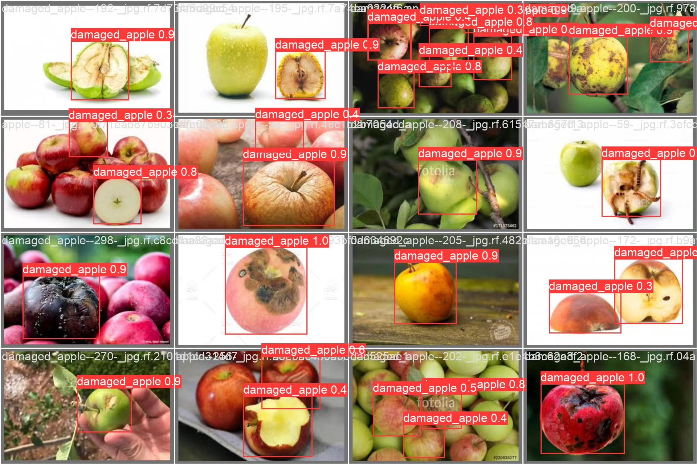

# Based on YOLOv10 deep learning for apple rot detection system

## Body

Based on YOLOv10 deep learning, an apple rot detection system (YOLOv10+YOLO dataset + UI interface + Python project source code + model)

An apple rot detection system based on deep learning is a smart system that focuses on detecting the state of apple rot. It uses advanced deep learning techniques (such as YOLOv10 or other object detection algorithms) to achieve high accuracy in detection. This system can automatically identify and locate damaged apples (damaged_apple), suitable for orchard management, fruit sorting, food quality inspection, and other scenarios. With this system, users can quickly identify rotten apples, reduce labor costs in manual detection, improve fruit sorting efficiency and quality control levels.

The company's products have obtained the official commercial license certification from YOLO.

After-sales service

After the payment is successful, we will provide a WeChat account number, and you can ask questions anytime.

Environment Configuration: A tutorial on environment configuration will be provided, and WeChat will provide Q&A.

Remote Installation Service: If you need to remotely configure the environment, an additional fee of 69 is required.
Configuration unsuccessful, all fees are refunded (specially for older computers, only installation fees are refunded).

Retrain the dataset: After setting up the environment, you can train on your own computer.
If you need us to train it for you, just pay 69 plus the computing power fee (2.5 yuan per hour).

Full package of after-sales service

## Images

## Payment

Here is a pay link on Stripe ( https://buy.stripe.com/3cs8yP7sY87d0vu9AB ). Please contact me lonlonago@foxmail.com after funding $89, and I will send you a complete data files , thank you!

